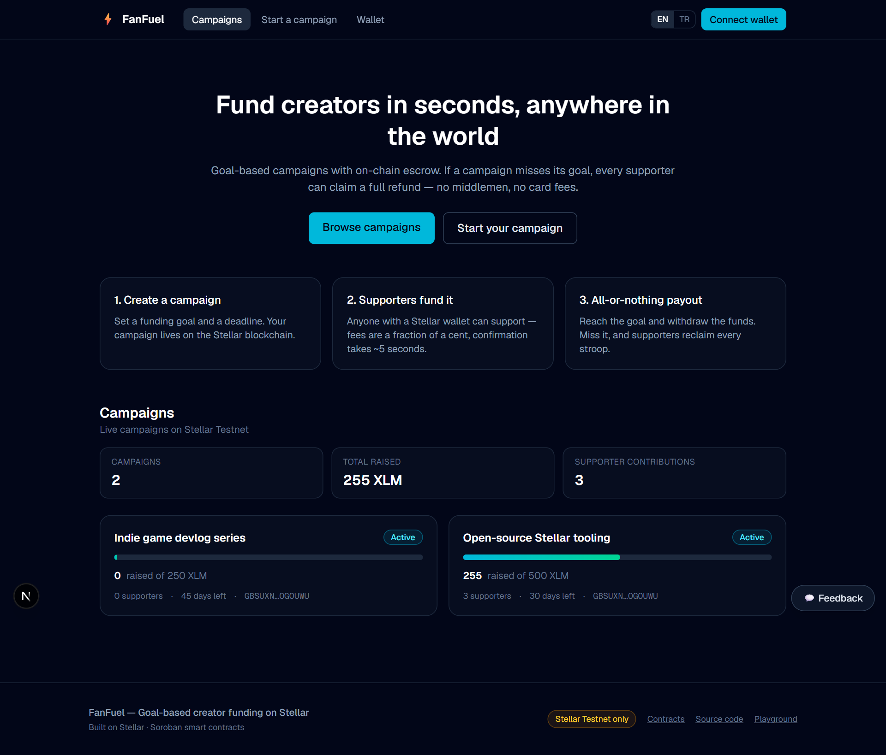
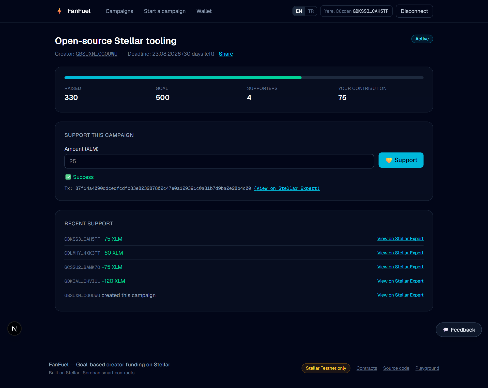
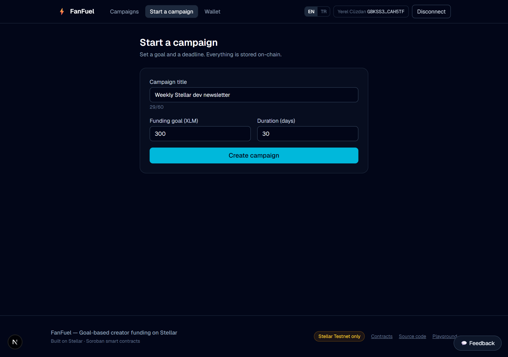
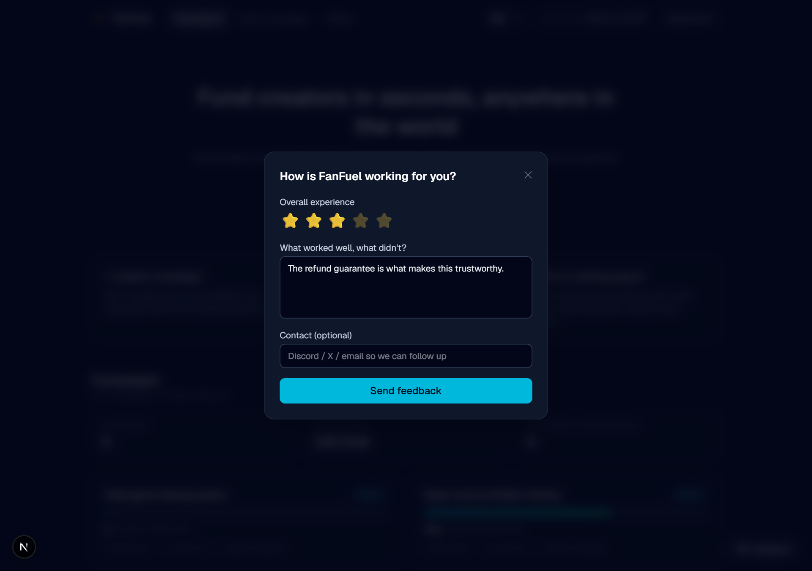
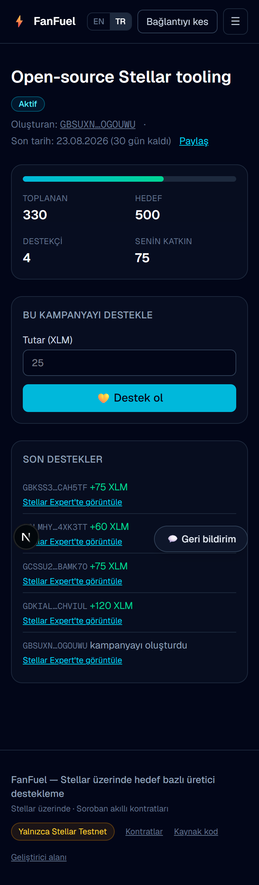
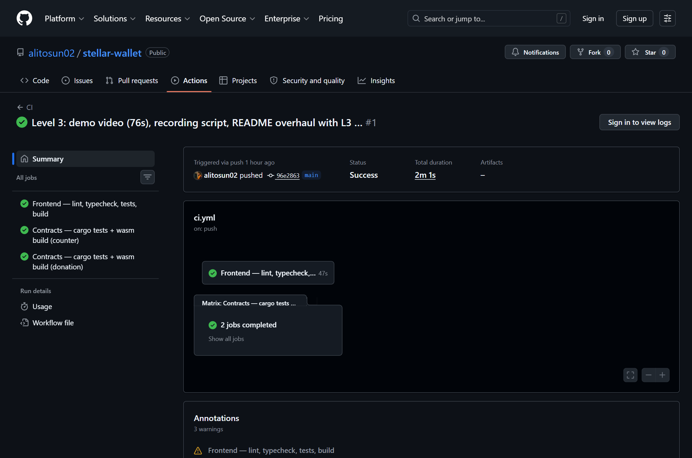
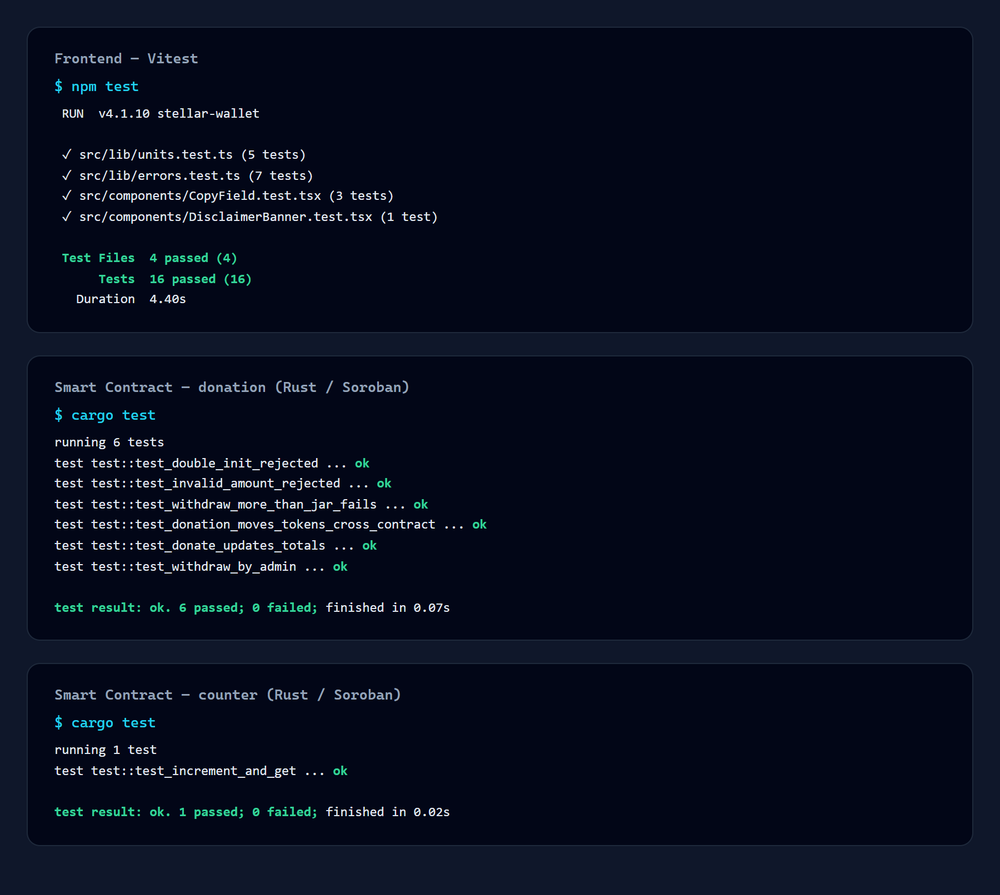

# FanFuel — Goal-based creator funding on Stellar

[](https://github.com/alitosun02/stellar-wallet/actions/workflows/ci.yml)

**Live app: [stellar-wallet-steel.vercel.app](https://stellar-wallet-steel.vercel.app/)** ·
**Demo video: [docs/demo.mp4](docs/demo.mp4)** (91s) ·
**Try it in 3 minutes: [docs/ONBOARDING.md](docs/ONBOARDING.md)**

FanFuel is a production-ready MVP for **all-or-nothing creator funding on Stellar**.
Supporters fund campaigns with XLM; funds sit in a Soroban smart-contract **escrow**.
Reach the goal → the creator withdraws. Miss it → **every supporter reclaims their full
contribution**. No middlemen, no card rails, fees of a fraction of a cent.

Built for the **Stellar Journey to Mastery: Monthly Builder Challenges** — Builder Track:
⚪️ Level 1 → 🟡 Level 2 → 🟠 Level 3 → 🟢 **Level 4 (current)**

---

## Why this exists

Creators in payment-underserved markets (Türkiye among them) cannot use Stripe-based
platforms — Patreon and Buy Me a Coffee are unavailable or restricted, charge 5–10% plus
card fees, enforce payout minimums, and exclude global micro-supporters. A $0.50
cross-border tip is economically impossible on card rails.

On Stellar it costs a fraction of a cent and settles in ~5 seconds. And because the escrow
logic lives in a smart contract, supporters don't have to trust the platform *or* the
creator: if the goal isn't met, the refund is enforced by the contract, not by a policy.

## 🟢 Level 4 — Requirements Coverage

| Requirement | Implementation |
|---|---|
| **Production-ready MVP** | Full product: browse → campaign detail → support → create → withdraw/refund, deployed on Vercel with CI/CD |
| **Stable frontend + contract architecture** | Layered `lib/` (SDK-isolated pure modules), typed contract clients, `useSyncExternalStore` state (SSR-safe, no hydration mismatch), 4 contracts on testnet |
| **Mobile responsive UI** | Every route works at 375px — [screenshot](#mobile-responsive-ui-375px) |
| **Loading states & error handling** | Skeleton loaders everywhere, explicit tx lifecycle (building → signing → pending → success/failed), 8 typed error categories incl. per-code Soroban contract errors, global error boundary |
| **10+ real users onboarded** | Onboarding guide in [docs/ONBOARDING.md](docs/ONBOARDING.md); on-chain proof auto-generated → [docs/USER_PROOF.md](docs/USER_PROOF.md) |
| **Proof of wallet interactions** | Every interaction is a verifiable on-chain contract call — see [USER_PROOF.md](docs/USER_PROOF.md) (generated by `scripts/collect-user-proof.mjs` straight from contract events) |
| **User feedback collection** | In-app feedback widget → `/api/feedback` → structured logs + optional webhook; summary in [docs/FEEDBACK.md](docs/FEEDBACK.md) |
| **Production deployment** | Vercel, auto-deploys `main` |
| **Monitoring & analytics** | Vercel Analytics (page + custom product events), Speed Insights (Web Vitals), client error reporting → `/api/log` (+ optional alert webhook) |
| **Optimized UX** | Bilingual EN/TR, one-click test wallet, Friendbot funding in-app, share links, live-updating campaign state |
| **Project structure & docs** | See [Architecture](#-architecture) — this README, onboarding, feedback and proof docs |
| **Contracts on testnet** | 3 custom contracts deployed (addresses below) |
| **15+ meaningful commits** | See git history |
| **Tests** | **36 frontend** (vitest + Testing Library) + **18 contract** (Rust) = **54 passing** |

### Deployed contracts (Stellar Testnet)

| Contract | Address | Purpose |
|---|---|---|
| **campaign** (Level 4) | [`CCUMBJRRHPBC6XRGCSK54NPY2IZ4EQGHAOL4B7XT5BUCHUYQKG2CLMUT`](https://stellar.expert/explorer/testnet/contract/CCUMBJRRHPBC6XRGCSK54NPY2IZ4EQGHAOL4B7XT5BUCHUYQKG2CLMUT) | Escrow, goals, deadlines, refunds |
| donation (Level 3) | [`CBEI7CRINGW5S4VT5MOD4NOVO6ZIJKCVDOHUAPFF6NHVGRLYUQSMLJRJ`](https://stellar.expert/explorer/testnet/contract/CBEI7CRINGW5S4VT5MOD4NOVO6ZIJKCVDOHUAPFF6NHVGRLYUQSMLJRJ) | TipJar with cross-contract transfers |
| counter (Level 2) | [`CCHEGI3ARKF6LGGLKQDBIPXSPD76DXHGOXO7SADH6ZUB3LUJ7YFGP437`](https://stellar.expert/explorer/testnet/contract/CCHEGI3ARKF6LGGLKQDBIPXSPD76DXHGOXO7SADH6ZUB3LUJ7YFGP437) | Auth + events demo |

**Example contract interactions (verifiable):**
[campaign deploy](https://stellar.expert/explorer/testnet/tx/2697de38097b8f2ba5e946c7ed66c938bdefb62ebde8de32dd8a4b4f6bf09bd4) ·
[campaign init](https://stellar.expert/explorer/testnet/tx/1c88f231ed419300f2dda03d82aae267becb095e420fe55eb76d5b2c227eb9cc) ·
[donate from the browser](https://stellar.expert/explorer/testnet/tx/f9c324afdcc1a6797d15c21f4bc3f16d82a5be0d19211637b53e5e466aa83559)

## 📸 Screenshots

### Product UI


### Supporting a campaign — contract call with live tx status


### Creating a campaign


### Feedback collection


### Mobile responsive UI (375px)


### CI/CD pipeline


### Test output


## 🔐 How the escrow works

```text
supporter ──sign──▶ donate(campaign_id, donor, amount)
                        │ require_auth(donor)
                        ├──▶ XLM SAC.transfer(donor → contract escrow)   [inter-contract]
                        ├──▶ state: raised, supporters, per-donor contribution
                        └──▶ event: Donation{donor, id, amount, raised}

        raised >= goal  ──▶ creator: withdraw()      → SAC.transfer(escrow → creator)
   deadline & raised<goal ──▶ supporter: claim_refund() → SAC.transfer(escrow → supporter)
```

State machine: `Active → Succeeded → Withdrawn` or `Active → Failed → (refunds)`.
Guard rails enforced on-chain and covered by tests: no donations after the deadline, no
withdrawal before the goal, no double withdrawal, no refund while active or after success,
no double refund.

## 🚀 Setup

```bash
git clone https://github.com/alitosun02/stellar-wallet.git
cd stellar-wallet
npm install
npm run dev          # http://localhost:3000
```

```bash
npm test                                # 36 frontend tests
npm run lint                            # eslint
npx tsc --noEmit                        # type check
cd contracts/campaign && cargo test     # 11 contract tests
cd contracts/donation && cargo test     # 6
cd contracts/counter  && cargo test     # 1
```

### Environment variables (optional)

| Variable | Purpose |
|---|---|
| `FEEDBACK_WEBHOOK_URL` | Mirror in-app feedback to Discord/Slack in real time |
| `MONITORING_WEBHOOK_URL` | Alert channel for client-side errors |

Without them the app still works: feedback and errors are written to server logs
(visible in the Vercel dashboard).

### Contract deployment workflow

```bash
rustup target add wasm32v1-none
stellar keys generate deployer --network testnet --fund
./scripts/deploy-contracts.sh deployer     # test → build → deploy → init
# then update the contract IDs in src/lib/*.ts
```

## 🏗️ Architecture

```
contracts/
  campaign/       Escrow contract: goals, deadlines, refunds, events (11 tests)
  donation/       TipJar: cross-contract SAC transfers (6 tests)
  counter/        Auth + events demo (1 test)
src/
  app/
    page.tsx                 Landing + campaign list
    campaigns/[id]/page.tsx  Campaign detail: support, withdraw, refund
    create/page.tsx          Campaign creation
    wallet/page.tsx          Balance, payments, history, live stream
    playground/page.tsx      Level 2–3 contracts, kept for reference
    api/feedback/route.ts    Feedback intake (validated, logged, webhook)
    api/log/route.ts         Client error intake (monitoring)
  components/    ui primitives · layout shell · campaigns · wallet · feedback
  hooks/         useWallet (session store) · useAsync (loading/error) · usePaymentStream (SSE)
  i18n/          EN/TR dictionary + locale store (parity enforced by tests)
  lib/
    campaign.ts      Campaign contract client (read via simulation, write via invoke)
    donation.ts      TipJar client
    counter.ts       Counter client
    stellar.ts       Horizon: accounts, balances, payments, history
    wallets.ts       Freighter / Albedo / local — one signing interface
    soroban.ts       Soroban RPC + native SAC
    errors.ts        Typed error classification (incl. contract error codes)
    units.ts         Pure XLM↔stroop math (SDK-free, unit tested)
    analytics.ts     Event tracking + error reporting
    persistentStore.ts  SSR-safe persistent state for useSyncExternalStore
scripts/
  deploy-contracts.sh      Repeatable contract deployment
  collect-user-proof.mjs   On-chain proof of user interactions → docs/USER_PROOF.md
  take-screenshots.mjs     Screenshot automation
  record-demo.mjs          Demo video recording
```

**Production practices applied**

- **No hydration mismatches**: persistent state (wallet session, locale) is exposed through
  `useSyncExternalStore` with a distinct server snapshot, instead of reading storage during render.
- **Chain is the source of truth**: no database for money state; campaign data is read from the
  contract and refreshed on an interval, so any client sees the same state.
- **Read without a wallet**: campaign lists/details use read-only simulation, so the product is
  browsable before connecting — a real conversion path, not a wallet gate.
- **Errors are typed, not stringly**: Soroban `#[contracterror]` codes and Horizon `result_codes`
  are mapped to user-facing messages in one place, with tests.
- **Secrets never touch SSR**: key material lives only in tab-scoped session storage.
- **Reproducible builds/deploys**: `--locked` cargo builds, scripted deployment, CI on every push.

## 📊 Monitoring & analytics

| Layer | Tool | What it captures |
|---|---|---|
| Product analytics | Vercel Analytics | Page views + custom events: `campaign_donate`, `campaign_created`, `campaign_share`, `feedback_submitted`, `friendbot_funded`, `payment_sent`, failures |
| Performance | Vercel Speed Insights | Real-user Web Vitals |
| Error tracking | `/api/log` + `ErrorBoundary` | Client exceptions with stack, route and user agent → structured server logs (+ optional webhook alert) |
| User feedback | `/api/feedback` | Rating, message, contact, wallet, locale, page |

## ⚠️ Security note

**Stellar Testnet only.** Never enter a secret key that controls mainnet assets. The built-in
test wallet keeps its key in tab-scoped `sessionStorage` (erased on close); prefer
**Freighter** or **Albedo**, where keys never touch the app and signing happens in the wallet.

## 🗺️ Roadmap

- 🔵 **Level 5**: scale to 50 users, iterate on feedback, pitch deck + demo
- ⚫️ **Level 6**: mainnet launch, USDC support with anchor off-ramp, security review, 20+ real users

## 📜 Level history

| Level | Scope |
|---|---|
| ⚪️ 1 | Wallet, balances, payments, Freighter connect |
| 🟡 2 | Multi-wallet, first deployed contract, real-time sync, typed errors |
| 🟠 3 | Inter-contract donation escrow, CI/CD, contract + frontend tests, mobile, demo |
| 🟢 4 | FanFuel product: campaign escrow contract, full product UI, i18n, analytics, monitoring, feedback, user onboarding |
