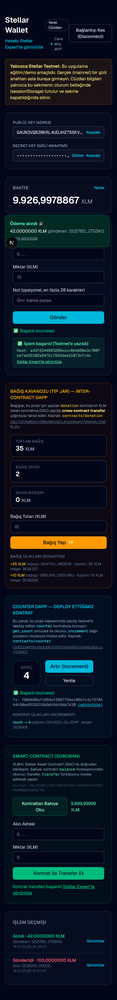

# Stellar Wallet & TipJar dApp — Rise In Builder Challenge

[](https://github.com/alitosun02/stellar-wallet/actions/workflows/ci.yml)

A production-structured **Stellar Testnet dApp**: multi-wallet support (**Freighter**, Albedo, local test keypair), payments, **two custom Soroban smart contracts** (a donation TipJar with cross-contract token transfers, and a counter), real-time event synchronization, full test coverage (contracts + frontend), and CI/CD.

Built level-by-level for the **Stellar Journey to Mastery: Monthly Builder Challenges** (Builder Track):
⚪️ Level 1 → 🟡 Level 2 → 🟠 **Level 3 (current)**

- **Live demo:** _Vercel deploy pending — link will be added after first deployment_
- **Demo video (1–2 min):** [docs/demo.mp4](docs/demo.mp4)

---

## 🟠 Level 3 (Orange Belt) — Requirements Coverage

| Requirement | Implementation |
|---|---|
| **Advanced smart contract development** | [`contracts/donation`](contracts/donation): typed errors (`contracterror`), enum storage keys, instance+persistent storage, TTL management, admin auth, typed events (`contractevent`) |
| **Inter-contract communication** | `donate()` collects funds by calling the **XLM Stellar Asset Contract's `transfer`** cross-contract (`token::Client`); `withdraw()` does the reverse. Verified in tests via token balances and on-chain via paired `transfer` + `Donation` events in one tx |
| **Event streaming & real-time updates** | Horizon SSE payment stream (balance/history auto-update + toast) and Soroban RPC `getEvents` polling for `Donation`/`Increment` contract events |
| **CI/CD pipeline** | [GitHub Actions](.github/workflows/ci.yml): frontend job (eslint, tsc, vitest, next build) + contract matrix job (cargo test + wasm build for both contracts); Vercel auto-deploys `main` (CD) |
| **Smart contract deployment workflow** | [`scripts/deploy-contracts.sh`](scripts/deploy-contracts.sh): test → build → deploy → init, repeatable per environment |
| **Mobile responsive frontend** | Fully responsive at 375px — see screenshot below |
| **Error handling & loading states** | Typed error classification ([`src/lib/errors.ts`](src/lib/errors.ts), 5 categories), tx lifecycle states (building/signing/pending/success/failed), skeleton loaders |
| **Tests for contracts and frontend** | **7 contract tests** (6 donation + 1 counter, incl. cross-contract balance assertions) + **16 frontend tests** (vitest + Testing Library) |
| **Production-ready architecture** | Layered: pure `lib/` modules (SDK-free `units.ts` testable in isolation), typed contract clients, single signing interface for all wallets, client-only rendering for key material |
| **Documentation & demo** | This README + demo video + inline docs |

### Submission checklist artifacts

| Item | Where |
|---|---|
| Contract deployment addresses | TipJar: [`CBEI7CRINGW5S4VT5MOD4NOVO6ZIJKCVDOHUAPFF6NHVGRLYUQSMLJRJ`](https://stellar.expert/explorer/testnet/contract/CBEI7CRINGW5S4VT5MOD4NOVO6ZIJKCVDOHUAPFF6NHVGRLYUQSMLJRJ) · Counter: [`CCHEGI3ARKF6LGGLKQDBIPXSPD76DXHGOXO7SADH6ZUB3LUJ7YFGP437`](https://stellar.expert/explorer/testnet/contract/CCHEGI3ARKF6LGGLKQDBIPXSPD76DXHGOXO7SADH6ZUB3LUJ7YFGP437) |
| Contract interaction tx hashes | donate (browser): [`a4cff8f45e00b3ab2d3aa90b2380fb1220047ba548561493dff7537c4600960a`](https://stellar.expert/explorer/testnet/tx/a4cff8f45e00b3ab2d3aa90b2380fb1220047ba548561493dff7537c4600960a) · donate (CLI, paired transfer+Donation events): [`d8bdcd13ada2d18c8095a2c11ed4727150b2b9718d31ad6dfb8df259529760e7`](https://stellar.expert/explorer/testnet/tx/d8bdcd13ada2d18c8095a2c11ed4727150b2b9718d31ad6dfb8df259529760e7) · counter increment: [`fcb88855033354511e813c62d7378509c07ac8278c6344d39a5b97fe37b26a29`](https://stellar.expert/explorer/testnet/tx/fcb88855033354511e813c62d7378509c07ac8278c6344d39a5b97fe37b26a29) |
| Mobile responsive UI screenshot | below |
| CI pipeline screenshot | below (added after first push triggers Actions) |
| Test output screenshot (3+ passing) | below — 23 passing total |
| Live demo link | pending Vercel deploy |
| Demo video | [docs/demo.mp4](docs/demo.mp4) (76s) |

### Level 3 Screenshots

#### Mobile responsive UI (375px)


#### Test output — 16 frontend + 7 contract tests passing


#### CI pipeline
_Screenshot will be added after the workflow runs on GitHub._

---

## The dApp

### 💛 TipJar — donation contract with inter-contract calls

Donations are collected by the `donation` contract calling the **XLM token contract (SAC)** cross-contract. State (total, per-donor cumulative, count) lives in the contract; every donation publishes a `Donation` event that the frontend streams into a live feed.

```text
donor wallet ──sign──▶ donate(donor, amount)
                          │  require_auth(donor)
                          ├──▶ SAC.transfer(donor → jar)   [inter-contract]
                          ├──▶ storage: total, count, per-donor
                          └──▶ publish Donation{donor, amount, total}
```

Admin-only `withdraw` moves funds out the same way (`SAC.transfer(jar → to)`).

### 🔢 Counter — auth + events demo contract

`increment` (requires the caller's signature, publishes `Increment`) and `get_count`. Read via `simulateTransaction`, written via `InvokeHostFunction` with the connected wallet's signature.

### Wallet features (Levels 1–2)

- Freighter connect/disconnect (`isConnected → setAllowed → getAddress → getNetwork`, signing via `signTransaction`), Albedo, or local test keypair
- Friendbot funding, balance display, XLM payments with full tx hash feedback
- Real-time payment stream (Horizon SSE): auto-refresh + live toast notifications
- Transaction history with Stellar Expert links

## 🚀 Setup

```bash
git clone https://github.com/alitosun02/stellar-wallet.git
cd stellar-wallet
npm install
npm run dev          # http://localhost:3000
```

```bash
npm test             # frontend tests (16)
npm run lint         # eslint
cd contracts/donation && cargo test   # contract tests (6)
cd contracts/counter  && cargo test   # contract tests (1)
```

### Freighter setup

1. Install [Freighter](https://freighter.app), create/import a wallet.
2. Switch Freighter to **Testnet** (Settings → Network).
3. Click **🚀 Freighter Cüzdanını Bağla** and approve.
4. Fund via **Friendbot ile Fonla** if the account is new.

### Contract deployment workflow

```bash
# one-time: rustup target add wasm32v1-none && stellar CLI kurulumu
stellar keys generate deployer --network testnet --fund
./scripts/deploy-contracts.sh deployer
# sonra kontrat adreslerini src/lib/counter.ts ve src/lib/donation.ts'de güncelleyin
```

CI runs the same test+build steps on every push; Vercel deploys `main` automatically (CD).

## 🏗️ Architecture

```
contracts/
  donation/                Soroban contract: cross-contract SAC transfers, typed errors, events (6 tests)
  counter/                 Soroban contract: auth'd writes + events (1 test)
src/
  lib/units.ts             Pure XLM↔stroop conversions (SDK-free, unit tested)
  lib/errors.ts            Typed error classification for all failure paths (unit tested)
  lib/stellar.ts           Horizon: accounts, balances, payments, history
  lib/wallets.ts           Multi-wallet: Freighter / Albedo / local + single sign interface
  lib/soroban.ts           Soroban RPC server + SAC interaction
  lib/counter.ts           Counter contract client (read / invoke with status / events)
  lib/donation.ts          TipJar contract client (stats / donate / events)
  hooks/usePaymentStream.ts  Horizon SSE stream hook
  context/WalletContext.tsx  Session-scoped connection state
  components/              Panels: onboarding, balance, payment, TipJar, Counter, SAC, history, toasts
  app/                     Next.js App Router (client-only wallet UI, no SSR for key material)
scripts/
  deploy-contracts.sh      Contract deployment workflow
  take-screenshots.mjs     Screenshot automation (puppeteer)
  record-demo.mjs          Demo video recording (puppeteer screencast)
.github/workflows/ci.yml   CI: lint + typecheck + 23 tests + builds (frontend & contracts)
```

**Production practices:** typed contract errors surfaced as user-friendly categorized messages; explicit tx lifecycle everywhere; skeleton loading states; pure logic modules isolated from the SDK for fast unit tests; secrets never touch SSR (client-only rendering); session-scoped key storage with hard warnings; reproducible deploys via locked dependencies (`--locked`) and scripted workflow.

## ⚠️ Security Note

**Testnet only.** Never enter a mainnet secret key. Local-wallet mode keeps the secret in tab-scoped `sessionStorage` (wiped on close) — prefer Freighter/Albedo, where keys never touch the app.

## 🗺️ Roadmap

- 🟢 Level 4: production-ready MVP (idea submission + approval first)
- 🔵 Level 5: 50 users, feedback iteration, pitch deck
- ⚫️ Level 6: mainnet launch, 20+ real users, security review

## 📜 Level History

| Level | Scope | Key commits |
|---|---|---|
| ⚪️ 1 | Wallet, balance, payments, Freighter connect | `a95ef22`, `2c7a193` |
| 🟡 2 | Multi-wallet, counter contract deploy, real-time sync, typed errors | `ad06ce7`, `b14031a` |
| 🟠 3 | Donation contract (inter-contract), tests, CI/CD, mobile, demo | `dc5c121`.. |
