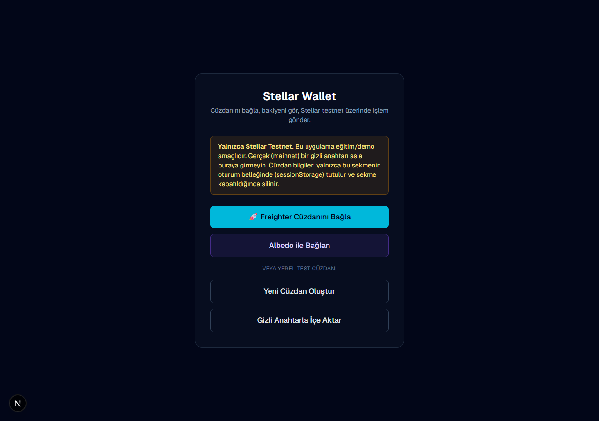
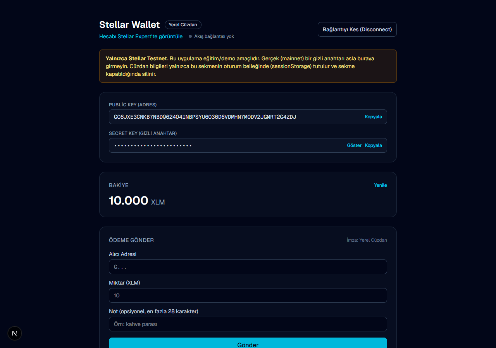
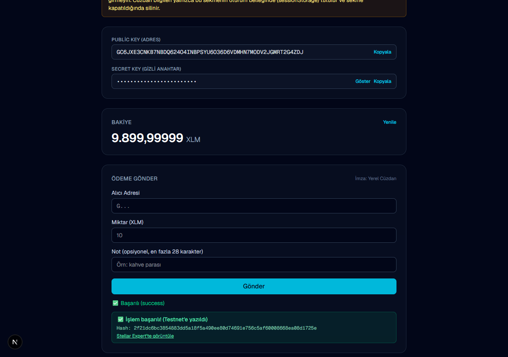
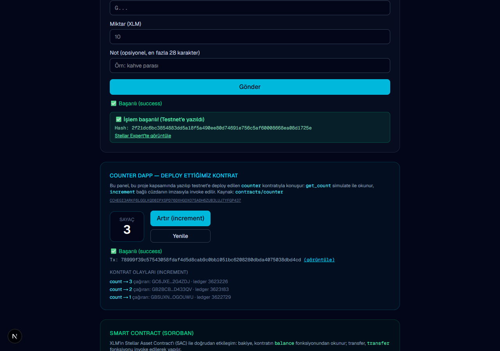
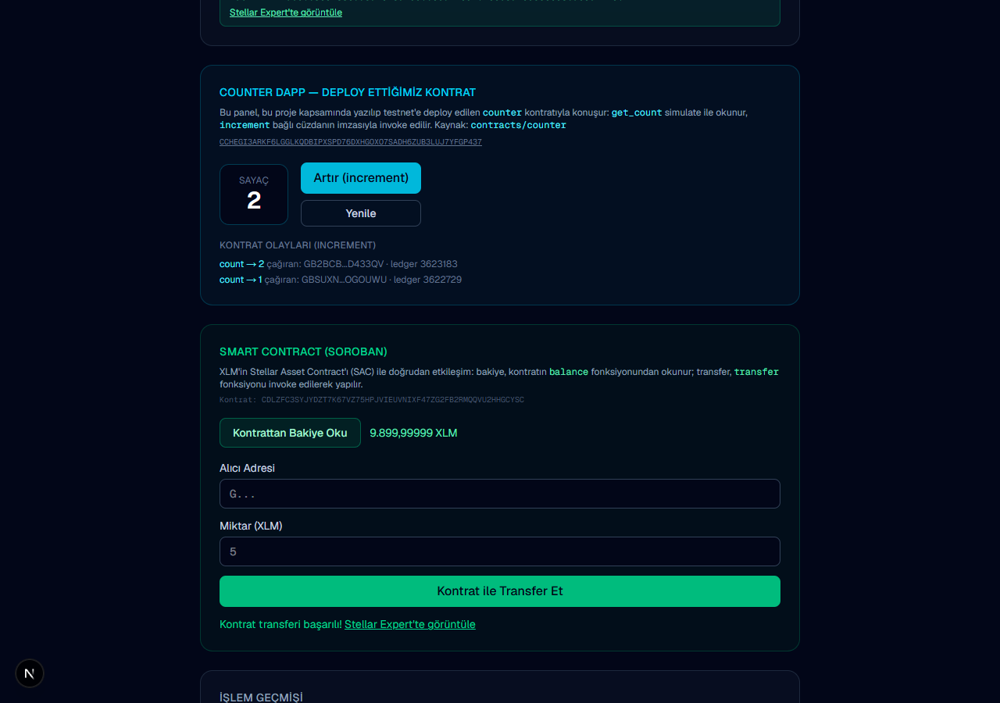
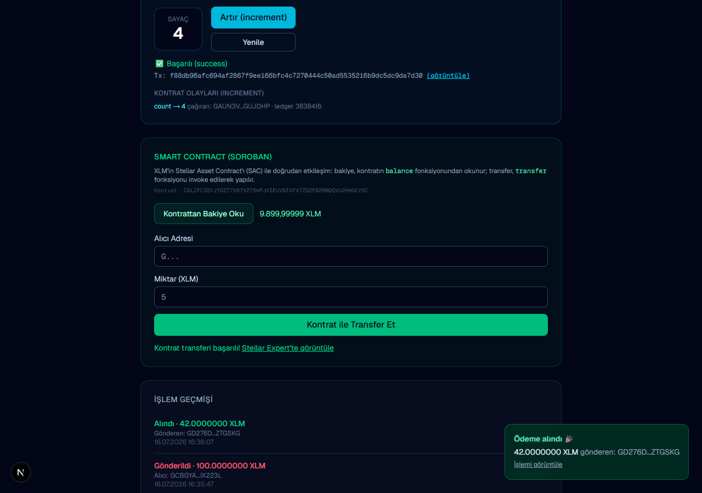

# Stellar Wallet — Rise In Builder Challenge

A browser-based Stellar **Testnet** wallet dApp built for the **Stellar Journey to Mastery: Monthly Builder Challenges** (Builder Track / Belt Progression).

Connect a wallet (**Freighter**, Albedo, or a local test keypair), fund it via Friendbot, view your XLM balance, and send real XLM transactions on the Stellar testnet — with live transaction feedback and real-time payment notifications.

---

## ✅ Level 1 (White Belt) Requirements Coverage

| Requirement | Implementation |
|---|---|
| **Freighter wallet setup** | Integrated via [`@stellar/freighter-api`](https://www.npmjs.com/package/@stellar/freighter-api) — see [`src/lib/wallets.ts`](src/lib/wallets.ts) |
| **Stellar Testnet** | All Horizon/Soroban calls use `Networks.TESTNET` (`horizon-testnet.stellar.org`) |
| **Wallet connect** | `isConnected()` → `setAllowed()` → `getAddress()` → `getNetwork()` flow in `connectFreighter()`; "🚀 Freighter Cüzdanını Bağla" is the primary CTA |
| **Wallet disconnect** | "Bağlantıyı Kes (Disconnect)" button clears the session (`clearConnection`) |
| **Fetch & display XLM balance** | Horizon `loadAccount` → balance card in UI, with Friendbot one-click funding for new accounts |
| **Send XLM transaction on testnet** | Payment built with `TransactionBuilder`, signed by the connected wallet (`signTransaction` for Freighter), submitted to Horizon |
| **Transaction feedback (success/failure + hash)** | Success panel shows the full **transaction hash** + Stellar Expert link; failures render clear error messages |
| **Error handling** | Invalid address/secret validation, unfunded account detection, network errors surfaced in UI |

## 📸 Screenshots

### 1. Wallet connect screen


### 2. Wallet connected — balance displayed


### 3. Successful testnet transaction (hash + explorer link)


> Screenshots are generated with the local test wallet mode (headless browsers cannot run the Freighter extension). Connecting with Freighter opens the exact same dashboard — only the wallet badge reads "Freighter" and signing happens inside the extension.

## 🚀 Setup — Run Locally

```bash
git clone https://github.com/alitosun02/stellar-wallet.git
cd stellar-wallet
npm install
npm run dev
```

Open [http://localhost:3000](http://localhost:3000).

### Freighter setup

1. Install the [Freighter extension](https://freighter.app) (Chrome/Firefox/Edge).
2. Create or import a wallet inside Freighter.
3. Open Freighter → **Settings → Network** and switch to **Testnet**.
4. In the app, click **🚀 Freighter Cüzdanını Bağla** and approve the connection prompt.
5. If your testnet account is new, click **Friendbot ile Fonla** to receive 10,000 test XLM.

### Try it without an extension

- **Albedo**: browser-popup signer, no extension needed.
- **Local test wallet**: generates a keypair in the browser (testnet only, stored in `sessionStorage`).

## 🧭 Usage Flow

1. **Connect** a wallet (Freighter / Albedo / local test keypair).
2. **Fund** the account via Friendbot if it's not active on testnet yet.
3. **Check balance** — displayed on the dashboard, refreshes automatically.
4. **Send XLM** — enter destination + amount, the connected wallet signs, and the app submits to testnet.
5. **See feedback** — success panel with transaction hash + [Stellar Expert](https://stellar.expert/explorer/testnet) link, or a descriptive error.
6. **Watch live** — incoming/outgoing payments stream in real time (Horizon SSE): balance and history auto-update with a toast notification.

## 🟡 Level 2 (Yellow Belt)

This repo has progressed to Level 2 on the same codebase.

### ✅ Level 2 Requirements Coverage

| Requirement | Implementation |
|---|---|
| **Contract deployed on testnet** | Custom `counter` Soroban contract (Rust) written, tested, and deployed by this project — source in [`contracts/counter`](contracts/counter) |
| **Deployed contract address** | [`CCHEGI3ARKF6LGGLKQDBIPXSPD76DXHGOXO7SADH6ZUB3LUJ7YFGP437`](https://stellar.expert/explorer/testnet/contract/CCHEGI3ARKF6LGGLKQDBIPXSPD76DXHGOXO7SADH6ZUB3LUJ7YFGP437) |
| **Contract called from the frontend** | `get_count` read via `simulateTransaction`; `increment` invoked with the connected wallet's signature (build → prepare → sign → send → poll) — see [`src/lib/counter.ts`](src/lib/counter.ts) |
| **Transaction hash of a contract call** | [`fcb88855033354511e813c62d7378509c07ac8278c6344d39a5b97fe37b26a29`](https://stellar.expert/explorer/testnet/tx/fcb88855033354511e813c62d7378509c07ac8278c6344d39a5b97fe37b26a29) (frontend invoke) · deploy tx: [`a74729e3fb34146a9ec9b22bc320d993fd761181f7df7e04c8469e6ebe7719e7`](https://stellar.expert/explorer/testnet/tx/a74729e3fb34146a9ec9b22bc320d993fd761181f7df7e04c8469e6ebe7719e7) |
| **3+ error types handled** | Centralized in [`src/lib/errors.ts`](src/lib/errors.ts) — see table below |
| **Transaction status visible** | Every payment/contract call shows its lifecycle in the UI: ⏳ building → ✍️ signing → 🔄 pending → ✅ success / ❌ failed |
| **Multi-wallet integrations** | Freighter (`@stellar/freighter-api`), Albedo (`@albedo-link/intent`), local test keypair — unified `signWithWallet` interface |
| **Real-time event integration** | Horizon SSE payment stream (balance/history auto-update + live toast) **and** Soroban RPC `getEvents` polling for the contract's `Increment` events |
| **2+ meaningful commits** | See git history (Level 1, Level 1 revision, Level 2, Level 2 contract...) |

### Error handling (3+ types, all user-facing)

| Type | Trigger | UI message |
|---|---|---|
| `WALLET_NOT_FOUND` | Freighter extension not installed | "Cüzdan bulunamadı: Freighter eklentisi kurulu değil..." |
| `USER_REJECTED` | Signing declined in wallet | "İşlem reddedildi: imza isteği cüzdanda onaylanmadı." |
| `INSUFFICIENT_BALANCE` | `tx_insufficient_balance` / `op_underfunded` from Horizon | "Yetersiz bakiye..." |
| `DESTINATION_NOT_FOUND` | Recipient account not funded on testnet | "Alıcı hesap bulunamadı / henüz aktive edilmemiş..." |
| `SOURCE_NOT_FOUND` | Sender account not funded yet | "Hesap bulunamadı: önce Friendbot ile fonlayın." |

### The deployed contract (`contracts/counter`)

A minimal but complete Soroban contract demonstrating **write** (`increment`, requires auth, publishes an `Increment` event) and **read** (`get_count`):

```bash
cd contracts/counter
cargo test                                        # unit tests (3 increments asserted)
cargo build --target wasm32v1-none --release      # compile to WASM
stellar contract deploy \
  --wasm target/wasm32v1-none/release/counter.wasm \
  --source-account <your-key> --network testnet
```

### Level 2 Screenshots

#### Counter dApp — deployed contract called from the frontend (tx status + contract events)


#### Soroban SAC panel — balance read from contract + successful contract transfer


#### Real-time payment notification — incoming payment streamed live (SSE), history auto-updated


## 🏗️ Project Structure

```
contracts/
  counter/                   Custom Soroban contract (Rust): increment/get_count + Increment event, unit tests
src/
  lib/stellar.ts             Horizon interactions (keypair, balances, payment build/submit, history)
  lib/wallets.ts             Multi-wallet abstraction (Freighter / Albedo / local) + unified signing
  lib/soroban.ts             Soroban RPC + SAC contract calls (balance simulate, transfer invoke)
  lib/counter.ts             Deployed counter contract client (read, invoke w/ status, getEvents)
  lib/errors.ts              Centralized error classification (wallet/balance/destination...)
  hooks/usePaymentStream.ts  Real-time Horizon SSE payment stream
  context/WalletContext.tsx  Wallet connection state (sessionStorage-backed)
  components/                UI components (onboarding, dashboard, contract panels, live toasts...)
  app/                       Next.js App Router entry points
scripts/
  take-screenshots.mjs       Automated README screenshot generation (puppeteer-core)
```

## 🛠️ Tech Stack

- [Next.js 16](https://nextjs.org) (App Router, Turbopack) + TypeScript + Tailwind CSS
- [`@stellar/stellar-sdk`](https://github.com/stellar/js-stellar-sdk) — Horizon + Soroban RPC
- [`@stellar/freighter-api`](https://docs.freighter.app) — Freighter wallet connection & signing
- [`@albedo-link/intent`](https://albedo.link/docs) — Albedo web signer

## ⚠️ Security Note

This project targets **Stellar Testnet only**. Never enter a secret key that controls mainnet assets. In local-wallet mode the secret lives in the tab's `sessionStorage` and is wiped when the tab closes; prefer **Freighter/Albedo** modes, where keys never touch the app and signing happens in the wallet.

## 🗺️ Roadmap (Next Belts)

- 🟠 Orange Belt (Level 3): complete mini dApp with a custom Soroban contract; tests and deployment.
- 🟢 Green Belt (Level 4): production-ready MVP.
- 🔵 Blue Belt (Level 5): scale to 50 users, pitch deck and demo.
- ⚫️ Black Belt (Level 6): mainnet launch, 20+ real users, security review.
